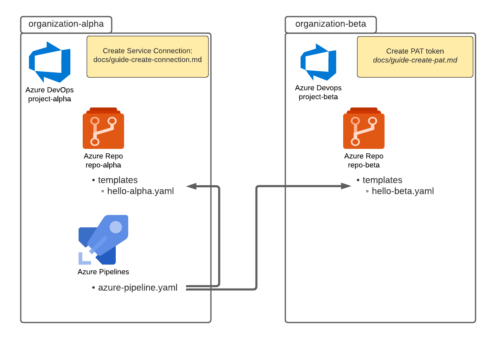

# Executing Pipeline Tasks from Different Azure DevOps Organizations

## Overview

Azure DevOps pipelines can reference pipeline `jobs` and `tasks` from repositories in [other organizations](https://docs.microsoft.com/en-us/azure/devops/pipelines/process/templates?view=azure-devops#use-other-repositories) via a `template`.

This sample app demonstrates how to use and call Azure Pipelines tasks template that exists in different Azure DevOps organization. The pipeline calls two different templates, one which is in the same repository and the other which is stored in a different Azure DevOps organization.



## Getting Started

### Folder Structure

Here's the folder structure for the sample:

- `build`
  - `azure-pipelines.yaml` - Main Azure Pipelines yaml file to create pipeline
  - `templates`
    - `hello-alpha.yaml` - Template file in the same repository to run a task

### Prerequisites

- [Azure CLI](https://docs.microsoft.com/en-us/cli/azure/install-azure-cli?view=azure-cli-latest)
- [Azure Subscription](https://azure.microsoft.com/en-us/)
- [Github Account](https://github.com/)
- [Azure Devops Account](https://www.dev.azure.com/)

### Running the Sample

To run this sample, follow the steps below:

1. Fork this repository in your Github account and clone it.

2. Create two different organizations, for example, `organization-alpha` and `organization-beta` Follow the [guide here](https://docs.microsoft.com/en-us/azure/devops/organizations/accounts/create-organization?view=azure-devops) on how to create a new organization.

3. [Create an Azure DevOps project](https://docs.microsoft.com/en-us/azure/devops/organizations/projects/create-project?view=azure-devops&tabs=preview-page), a repository and the yaml template file `hello-beta.yaml` in `organization-beta`.

4. Create a personal access token (PAT) in the organization where you created the `hello-beta.yaml` template (`organization-beta`). 
Please see [the guide here](./docs/guide-create-pat.md). This PAT can be used when setting up the service connection.

5. Create a new service connection of type `Azure Repos/Team Foundation Server` on the organization you will run your pipeline from (`organization-alpha`). This will define and secure connection to the other organization. Please follow [this guide here](./docs/guide-create-connection.md) on how to create this service connection. Use the PAT token you created above.

6. Create your pipeline in Azure Pipelines using existing the `azure-pipelines.yaml` file. For more instructions on how to create a pipeline, please see [this guide](https://docs.microsoft.com/en-us/azure/devops/pipelines/create-first-pipeline?view=azure-devops&tabs=python%2Ctfs-2018-2%2Cbrowser#create-your-first-python-pipeline).

7. Open the `azure-pipelines.yaml` file, and change `variables` section as needed along with the `resource` configuration according to the [step below](#configuring-access-to-other-organizations). After the configuration updates, commit your changes.

8. Run your pipeline. The pipeline output of a successful run will look like below:

    

## Referencing pipeline steps

For templates in the same repository, the `yaml` file containing the pipeline steps is referenced via the `template` step(s):

```yaml
steps:
- template: templates/hello-alpha.yaml
```

For files in repositories that are in another organization, a [service connection](https://docs.microsoft.com/en-us/azure/devops/pipelines/library/service-endpoints?view=azure-devops&tabs=yaml) of type `Azure Repos/Team Foundation Server` is required to access the organization. For a guide on how to set this up, [follow this document](./docs/guide-create-connection.md)

## Configuring access to other organizations

The pipeline references the service connection through a `resource` where the `endpoint` points to a service connection configured in this organization. The `repository` keyword lets you specify an external repository.

```yaml
resources:
  repositories: 
    - repository: remoteRepo # Simple name to reference this repository at a later step
      type: git
      name: project-name/repo-name
      endpoint: remote-git-connection # Azure DevOps service connection
      ref: refs/heads/main 
      
# Note: When referencing a repository in another organization, branches may need to be set explicitly using `ref` in the repository definition. 

# It may be necessary to do even when a file is located in the other organization's default branch.
```

The `template` then references this repository resource by adding the repository reference to the file reference:

```yaml
# The template hello-beta.yaml is stored in a repository and is being called from a pipeline that exists in another repository. 

# The syntax of using @remoteRepo allows the calling pipeline to get the remoteRepo reference that was defined above and resolve it.

- template: templates/hello-beta.yaml@remoteRepo
```

To see the full contents of the `templates/hello-beta.yaml`, please see the [code sample section](#code-sample)

## Code Sample

See below the template `templates/hello-beta.yaml` file that installs and runs azurite and is located in another organization under `project-name/repo-name`:

```yaml
steps:  
- bash: |
    echo "Hello from a different Azure DevOps Organization!"
  displayName: 'Hello from Beta'
```

## References

- [How to create and configure a Personal Access Token (PAT)](./docs/guide-create-pat.md)
- [How to setup a service connection](./docs/guide-create-connection.md)
- [Reference templates from other organizations](https://docs.microsoft.com/en-us/azure/devops/pipelines/process/templates?view=azure-devops#use-other-repositories)
