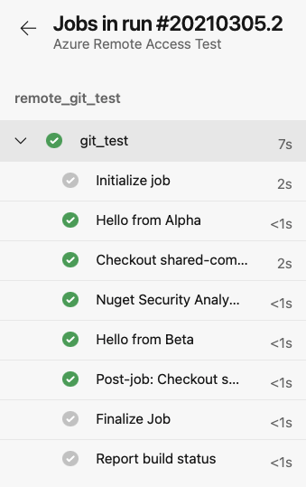

# Executing Pipeline Tasks from Different Azure DevOps Organizations

## Overview

Azure DevOps pipelines can reference pipeline `jobs` and `tasks` from repositories in [other organizations](https://docs.microsoft.com/en-us/azure/devops/pipelines/process/templates?view=azure-devops#use-other-repositories) via a `template`.

This sample app demonstrates how to use and call Azure Pipelines tasks template that exists in different Azure DevOps organization. The pipeline calls two different templates, one which is in the same repository and the other which is stored in a different Azure DevOps organization.

## Getting Started

### Folder Structure

Here's the folder structure for the sample:

- `build`
  - `azure-pipelines.yaml` - Main Azure Pipelines yaml file to create pipeline
  - `templates`
    - `python-tasks.yaml` - Template file in the same repository to run a task

### Prerequisites

- [Azure CLI](https://docs.microsoft.com/en-us/cli/azure/install-azure-cli?view=azure-cli-latest)
- [Azure Subscription](https://azure.microsoft.com/en-us/)
- [Github Account](https://github.com/)
- [Azure Devops Account](https://www.dev.azure.com/)

### Running the Sample

To run this sample, follow the steps below:

1. Fork this repository

2. Clone the repository using: `git clone https://github.com/Azure-Samples/azure-pipeline-tasks.git`

3. Given that you have tasks that need to be referenced from a different organization that you are running your pipeline in, the following is needed to get set up:

   - Create a new service connection of type `Azure Repos/Team Foundation Server` which will define and secure connection to another Azure DevOps organization or follow [this guide here](./docs/guide-to-setup-service-connection.md) on how to create it.
   - To authenticate using Personal Access Tokens (PAT), please see [the guide here](./docs/guide-to-creating-a-pat.md). This PAT can be used when setting up the service connection.

4. Create your pipeline in Azure Pipelines using existing the `azure-pipelines.yaml` file. For more instructions on how to create a pipeline, please see [this guide](https://docs.microsoft.com/en-us/azure/devops/pipelines/create-first-pipeline?view=azure-devops&tabs=python%2Ctfs-2018-2%2Cbrowser#create-your-first-python-pipeline)

5. Run your pipeline. The pipeline output of a successful run will look like below:

    

## Referencing pipeline steps

For repositories in the same repository, the `yaml` file containing the pipeline steps is referenced via the `template` step(s):

```yaml
steps:
- template: templates/python-tasks.yaml
```

For files in repositories that are in another organization, a [service connection](https://docs.microsoft.com/en-us/azure/devops/pipelines/library/service-endpoints?view=azure-devops&tabs=yaml) of type `Azure Repos/Team Foundation Server` is required to access the organization. For a guide on how to set this up, [follow this document](./docs/guide-to-setup-service-connection.md)

## Configuring access to other organizations

The pipeline references the service connection through a `resource` where the `endpoint` points to a service connection configured in this organization. The `repository` keyword lets you specify an external repository.

```yaml
resources:
  repositories: 
    - repository: remoteRepo # Simple name to reference this repository at a later step
      type: git
      name: project-name/repo-name
      endpoint: remote-git-connection # Azure DevOps service connection
      ref: refs/heads/main 
      
# Note: When referencing a repository in another organization, branches may need to be set explicitly using `ref` in the repository definition. 

# It may be necessary to do even when a file is located in the other organization's default branch.
```

The `template` then references this repository resource by adding the repository reference to the file reference:

```yaml
# The template install-software.yaml is stored in a repository and is being called from a piepline that exists in another repository. 

# The syntax of using @remoteRepo allows the calling pipeline to get the remoteRepo reference that was defined above and resolve it.

- template: templates/install-software.yaml@remoteRepo
```

To see the full contents of the `templates/install-software.yaml`, please see the [code sample section](#code-sample)

## References

- [How to create and configure a Personal Access Token (PAT)](./docs/guide-to-creating-a-pat.md)
- [How to setup a service connection](./docs/guide-to-setup-service-connection.md)

## Code Sample

See below the template `templates/install-software.yaml` file that installs and runs azurite and is located in another organization under `project-name/repo-name`:

```yaml
steps:  
- bash: |
    sudo npm install -g azurite
    sudo mkdir azurite
    sudo azurite --silent --location azurite --debug azurite\debug.log &
  displayName: 'Install and Run Azurite'
```
