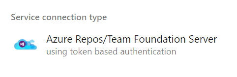
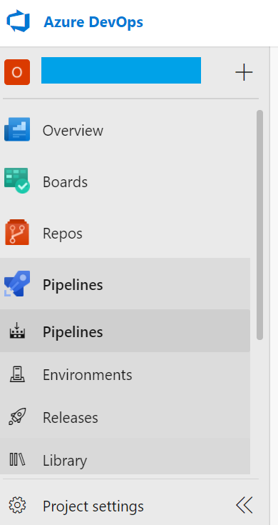
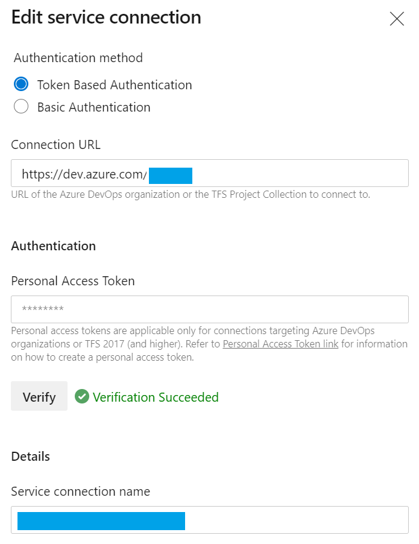
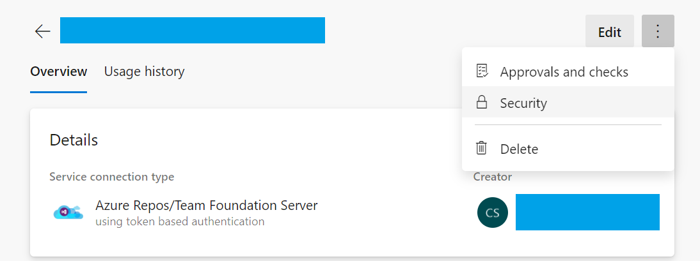
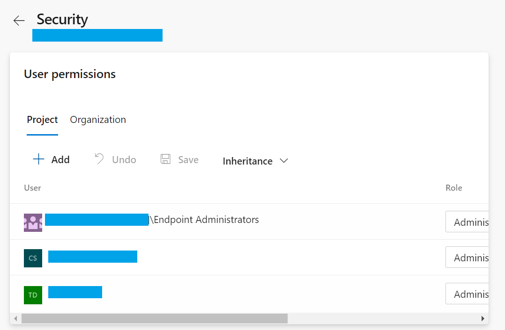

# Setup Service Connections to Access Different Azure DevOps Organizations

The service connection of type `Azure Repos/Team Foundation Server` is required to access the organization

1. The connection is configured with a token based or username/password based authentication that has the appropriate permissions. For details on how to setup the personal access token, please see [this guide](./guide-create-pat.md). This token should be created in the other organization that you are trying to access which has the templates or tasks that you need to run.

2. After you have created the token, go to the `Project settings` in the target organization where the pipeline is being run.

    

3. Select `Service connections` and click `New service connection`, this will begin the setup process to create the service connection with the token based authentication.

    

4. Other users can be granted access to the service connection by navigating to `Security` from the ellipses:

    

5. Finally, adding access for the desired users:
    

## References

[Learn more about service connections and how to set it up](https://docs.microsoft.com/en-us/azure/devops/pipelines/library/service-endpoints?view=azure-devops&tabs=yaml#create-a-service-connection)
