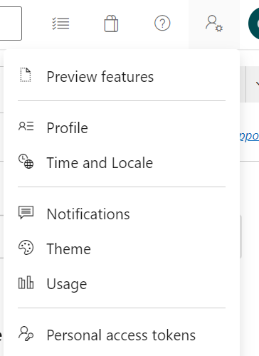
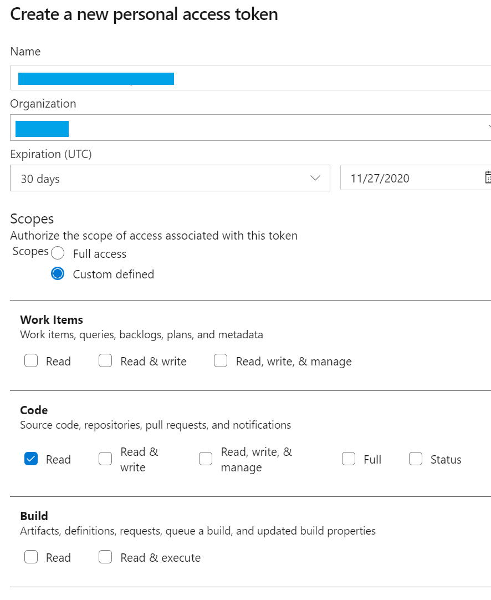
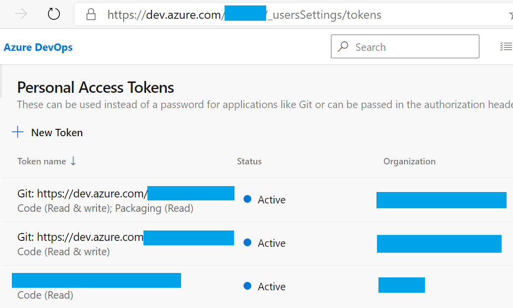

# Creating and Configuring a Personal Access Token (PAT)

This document is a guide on how to create a personal access token that has only Code Read privilege assigned, following the [Principle of least privilege](https://en.wikipedia.org/wiki/Principle_of_least_privilege).  

1. Go to the Azure DevOps organization where the template is stored. On the Azure DevOps page, the token is created from the `User Settings` menu:

    

2. Selecting a `Custom defined` `Scope` for the token that only allows `Read` access to repositories in the targeted organization where you will be running your pipeline from.

    

3. The token is shown in the list of available tokens for the user that created it.

    

## References

[Learn more about PAT and how to set it up](https://docs.microsoft.com/en-us/azure/devops/organizations/accounts/use-personal-access-tokens-to-authenticate?view=azure-devops&tabs=preview-page)
